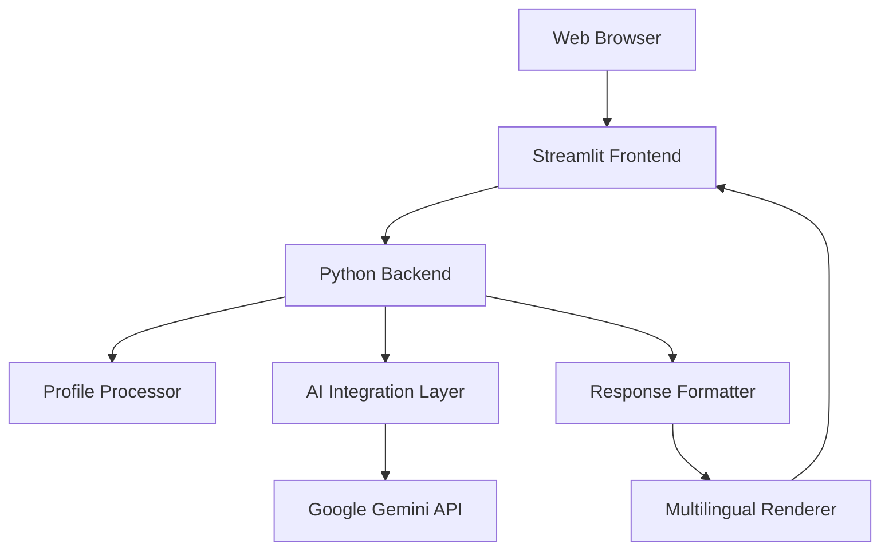

# Design Document

## Overview

SchemeSetu is a web-based government scheme finder that leverages AI to provide personalized recommendations to Indian citizens. The application uses a client-server architecture built on Streamlit, integrating with Google's Gemini AI to analyze user profiles and generate detailed scheme recommendations with multilingual support.

The system follows a reactive programming model where user interactions trigger real-time AI analysis, providing immediate feedback with detailed eligibility explanations. The design emphasizes simplicity, accessibility, and cultural appropriateness for diverse Indian users.

## Architecture

### High-Level Architecture



### Component Architecture

The application follows a layered architecture pattern:

1. **Presentation Layer**: Streamlit-based web interface
2. **Business Logic Layer**: Profile processing and validation
3. **Integration Layer**: AI service communication
4. **Data Layer**: User session state management

### Technology Stack

- **Frontend Framework**: Streamlit (Python-based reactive UI)
- **Backend Runtime**: Python 3.8+
- **AI Service**: Google Gemini 2.5 Flash
- **Deployment**: Local development server (extensible to cloud)
- **Dependencies**: streamlit, google-generativeai, python-dotenv

## Components and Interfaces

### 1. User Interface Component

**Responsibilities:**
- Collect user demographic information
- Display AI-generated recommendations
- Handle multilingual content rendering
- Manage user session state

**Key Methods:**
```python
def render_profile_form() -> UserProfile
def display_scheme_recommendations(schemes: List[Scheme]) -> None
def handle_language_selection(language: str) -> None
def show_loading_state(message: str) -> None
```

### 2. Profile Processor Component

**Responsibilities:**
- Validate user input data
- Structure profile information for AI consumption
- Handle data type conversions and formatting

**Key Methods:**
```python
def validate_profile(profile: UserProfile) -> ValidationResult
def format_for_ai(profile: UserProfile) -> str
def extract_demographics(form_data: dict) -> UserProfile
```

### 3. AI Integration Component

**Responsibilities:**
- Configure Gemini AI client
- Generate contextual prompts
- Handle API communication and error management
- Parse AI responses

**Key Methods:**
```python
def configure_ai_client(api_key: str) -> GenerativeModel
def generate_scheme_prompt(profile: UserProfile, language: str) -> str
def query_ai_service(prompt: str) -> AIResponse
def handle_ai_errors(error: Exception) -> ErrorResponse
```

### 4. Response Formatter Component

**Responsibilities:**
- Parse AI-generated content
- Structure scheme information
- Apply consistent formatting
- Handle multilingual content

**Key Methods:**
```python
def parse_ai_response(response: str) -> List[Scheme]
def format_eligibility_explanation(scheme: Scheme) -> str
def apply_markdown_formatting(content: str) -> str
def validate_response_structure(response: str) -> bool
```

## Data Models

### UserProfile
```python
@dataclass
class UserProfile:
    age: int
    gender: str  # "Male", "Female", "Other"
    state: str
    occupation: str
    income_bracket: str
    social_category: str  # "General", "OBC", "SC/ST", "Minority"
    preferred_language: str
```

### Scheme
```python
@dataclass
class Scheme:
    name: str
    benefit_summary: str
    eligibility_explanation: str
    required_documents: List[str]
    scheme_type: str  # "Central", "State"
    target_demographics: List[str]
```

### AIResponse
```python
@dataclass
class AIResponse:
    schemes: List[Scheme]
    consolidated_documents: List[str]
    language: str
    confidence_score: float
    processing_time: float
```

### ValidationResult
```python
@dataclass
class ValidationResult:
    is_valid: bool
    errors: List[str]
    warnings: List[str]
```

## Correctness Properties

*A property is a characteristic or behavior that should hold true across all valid executions of a system-essentially, a formal statement about what the system should do. Properties serve as the bridge between human-readable specifications and machine-verifiable correctness guarantees.*

<function_calls>
<invoke name="prework">
<parameter name="featureName">government-scheme-finder

Based on the prework analysis, I'll now convert the testable acceptance criteria into correctness properties:

### Property 1: Age Validation Range
*For any* age input value, the system should accept values between 0 and 100 inclusive, and reject all values outside this range
**Validates: Requirements 1.2**

### Property 2: AI Response Scheme Count
*For any* valid user profile, the AI engine should return exactly 3 government schemes in its response
**Validates: Requirements 2.1**

### Property 3: Scheme Type Diversity
*For any* AI response containing multiple schemes, the response should include both central government and state-specific schemes when available
**Validates: Requirements 2.2**

### Property 4: Profile Data Inclusion
*For any* user profile, the generated AI prompt should contain all profile fields (age, gender, state, occupation, income, category)
**Validates: Requirements 2.4**

### Property 5: Scheme Information Completeness
*For any* recommended scheme in the AI response, it should contain a scheme name, benefit summary, and qualification reasoning
**Validates: Requirements 3.1**

### Property 6: Eligibility Explanation Profile References
*For any* scheme eligibility explanation, it should reference at least one specific user profile attribute (age, gender, state, occupation, income, or category)
**Validates: Requirements 3.2**

### Property 7: Qualification Reasoning Format
*For any* scheme eligibility explanation, it should contain the phrase "You qualify because" followed by specific criteria
**Validates: Requirements 3.3**

### Property 8: Document Requirements Presence
*For any* recommended scheme, it should include a list of required documents
**Validates: Requirements 3.4**

### Property 9: Consolidated Document List
*For any* AI response, it should provide a consolidated list of all required documents across all recommended schemes
**Validates: Requirements 3.5**

### Property 10: Language-Specific Response Generation
*For any* selected language, the AI response should be generated in that specific language when the language parameter is passed to the AI prompt
**Validates: Requirements 4.2**

### Property 11: Loading State Display
*For any* scheme analysis request, a loading indicator should be displayed during AI processing
**Validates: Requirements 5.4**

### Property 12: Success Confirmation Display
*For any* successful scheme analysis completion, a success message should be displayed to the user
**Validates: Requirements 5.5**

### Property 13: Error Message Display
*For any* error condition (API failures, validation errors), appropriate error messages should be displayed to the user
**Validates: Requirements 5.6**

### Property 14: AI Client Configuration
*For any* valid API key, the system should successfully configure the Gemini AI client with the provided credentials
**Validates: Requirements 6.4**

### Property 15: Response Formatting Structure
*For any* AI response, it should be formatted with markdown headings and bullet points for clear presentation
**Validates: Requirements 7.1**

### Property 16: Visual Scheme Separation
*For any* multi-scheme response, different schemes should be visually separated in the display
**Validates: Requirements 7.2**

### Property 17: Key Information Highlighting
*For any* scheme response, important information like scheme names and benefits should be visually emphasized
**Validates: Requirements 7.3**

### Property 18: Document List Formatting
*For any* document requirements, they should be presented as organized lists rather than plain text
**Validates: Requirements 7.4**

### Property 19: Cross-Language Formatting Consistency
*For any* supported language, the response formatting structure should remain consistent regardless of the output language
**Validates: Requirements 7.5**

## Error Handling

### Input Validation Errors
- **Age Range Validation**: Display clear error messages for ages outside 0-100 range
- **Required Field Validation**: Ensure all demographic fields are selected before analysis
- **API Key Validation**: Block analysis and show error when API key is missing

### AI Service Errors
- **API Connection Failures**: Display user-friendly messages for network issues
- **Authentication Errors**: Show specific messages for invalid API keys
- **Rate Limiting**: Handle API quota exceeded scenarios gracefully
- **Response Parsing Errors**: Manage malformed AI responses with fallback messaging

### System Errors
- **Session State Errors**: Handle Streamlit session state corruption
- **Memory Errors**: Manage large response processing issues
- **Timeout Handling**: Set reasonable timeouts for AI requests

### Error Recovery Strategies
- **Graceful Degradation**: Continue operation with reduced functionality when possible
- **User Guidance**: Provide clear instructions for resolving common issues
- **Retry Mechanisms**: Implement automatic retry for transient failures
- **Logging**: Capture error details for debugging while protecting user privacy

## Testing Strategy

### Dual Testing Approach

The testing strategy employs both unit tests and property-based tests to ensure comprehensive coverage:

**Unit Tests**: Focus on specific examples, edge cases, and integration points
- Test specific UI component rendering
- Validate error handling scenarios
- Test API integration with mock responses
- Verify specific language output examples

**Property-Based Tests**: Verify universal properties across all inputs
- Generate random user profiles to test AI response consistency
- Test input validation across wide ranges of values
- Verify response formatting across different languages
- Test error handling with various failure scenarios

### Property-Based Testing Configuration

**Framework**: Use Hypothesis for Python property-based testing
**Test Configuration**: Minimum 100 iterations per property test
**Test Tagging**: Each property test references its design document property using the format:
```python
# Feature: government-scheme-finder, Property 1: Age Validation Range
```

### Testing Implementation Guidelines

**Profile Generation Strategy**:
- Generate realistic demographic combinations
- Include edge cases (minimum/maximum ages, various state combinations)
- Test with all supported languages
- Include invalid inputs to test error handling

**AI Response Testing**:
- Mock AI responses for consistent testing
- Test response parsing with various formats
- Verify multilingual content handling
- Test error scenarios (malformed responses, API failures)

**UI Testing Approach**:
- Test component rendering with Streamlit testing utilities
- Verify form validation behavior
- Test user interaction flows
- Validate responsive design elements

### Test Coverage Requirements

**Functional Coverage**:
- All user input validation scenarios
- Complete AI integration workflow
- Error handling for all identified failure modes
- Multilingual functionality across all supported languages

**Property Coverage**:
- Each correctness property must have a corresponding property-based test
- Properties should be tested with diverse, randomly generated inputs
- Edge cases should be explicitly included in property test generators

**Integration Coverage**:
- End-to-end user workflows from profile input to scheme display
- API integration with various response scenarios
- Error recovery and user guidance flows